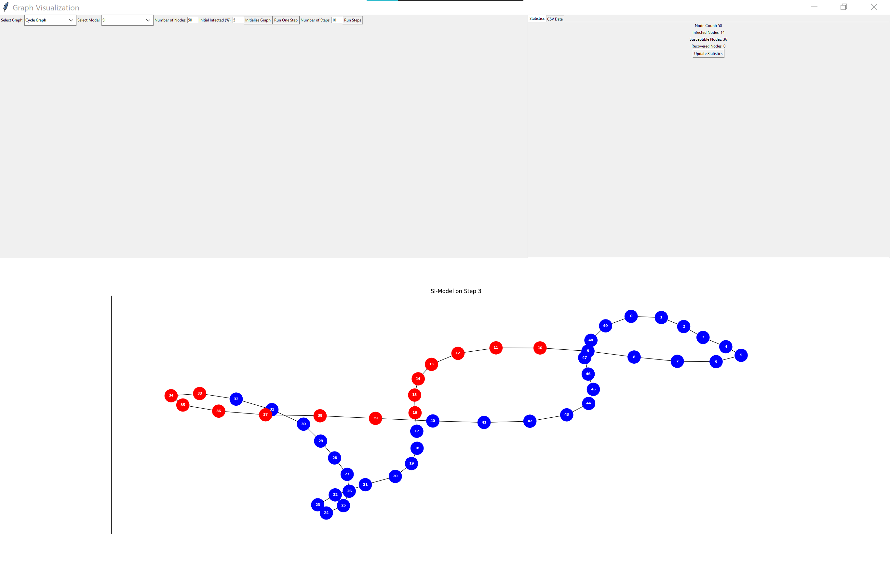

Pandemic Simulation Project
Overview
This project was an initial attempt at creating a user interface for a pandemic simulation using Python. While the project was ultimately abandoned, it includes a functional pandemic graph. The more complex pandemic model with infections and cures is currently not operational in this repository.
Current Status

The pandemic graph is working as expected.
The user interface was found to be suboptimal and needs improvement.
The pandemic model with infections and cures is not functional in this version.

How to Run
To try out the project, simply run the main.py file:
python main.py
This will launch the application and allow you to interact with the functional parts of the project.
Screenshots

markdownCopy

For a more advanced pandemic model, please refer to the separate "pandemic" repository, which contains improved notebooks for simulation.

Notes for Users
This project is currently in an incomplete state. For those interested in the pandemic model, it is recommended to check the separate "pandemic" repository for more up-to-date and functional implementations.
Links
[Link to the improved pandemic repository] ([Please insert the actual link here](https://github.com/D0MI-1/Pandemic))
